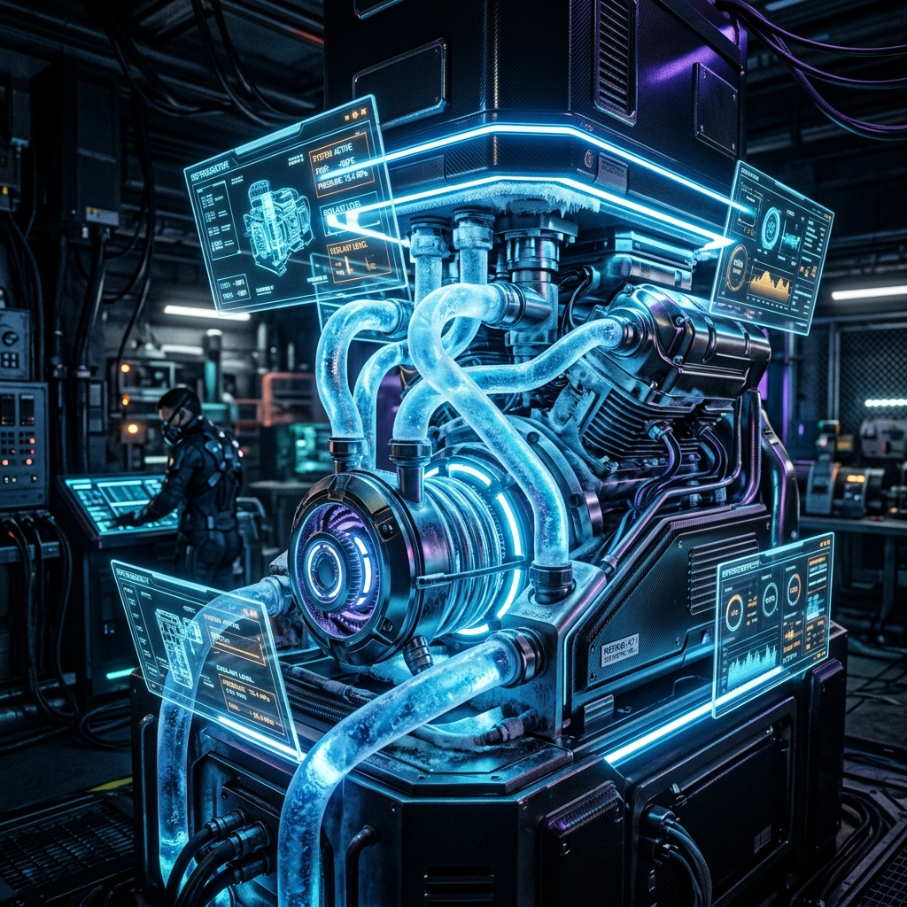
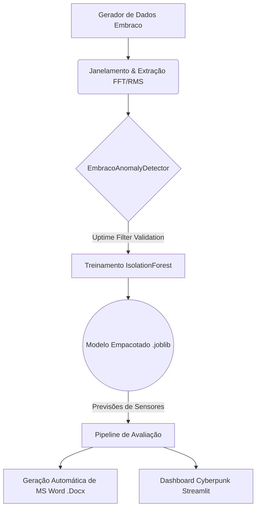

<div align="center">
  
  
  <h1>❄️ Inteligência Analítica & Preditiva: Compressor Embraco EM2X3125U</h1>
  <p><strong>Plataforma MLOps End-to-End para Manutenção Preditiva Industrial, Detecção de Anomalias Vibroacústicas e Relatórios C-Level.</strong></p>

  <p>
    
    
    
    
    
  </p>
</div>

---

## 🚀 O Desafio e a Nossa Solução

Em ambientes industriais de ponta, compressores criogênicos operam em limites complexos. Diagnosticar falhas mecânicas requer mais do que alertas genéricos. Esta arquitetura foi construída para **elevar a manutenção preditiva a outro patamar.**

Nós substituímos a análise bruta de sensores por um pipeline orquestrado que capta dados brutos, extrai conhecimento matemático via *Fast Fourier Transform* (FFT), treina um modelo de IA tolerante a operações variáveis e entrega o resultado em um **Cockpit (Dashboard) Interativo de Nível Executivo**.

### ✨ Features de Nível Corporativo
*   **Filtro Sensorial de Uptime Inteligente:** O modelo compreende se o motor está em Repouso (*Idle*), em Partida (*Startup*) ou Operação Contínua (*Steady State*), erradicando Falsos Positivos causados por oscilações naturais.
*   **Z-Score Híbrido & Isolation Forest:** A matriz de decisão une distância euclidiana (Z-Score) não-linear com agrupamento por árvores de floresta randômica.
*   **Front-End Sci-Fi Interativo:** Escrito com injeção de *Custom CSS* no Streamlit e gráficos fluidos baseados no motor *Plotly*.
*   **Automação de Relatórios em MS Word:** Não basta prever a falha, o projeto traduz dados matemáticos em apresentações de linguagem executiva `.docx` em 3 segundos rodando o MLOps via linha de comando!

---

## 🛠️ Arquitetura do Sistema (MLOps Pipeline)

A inteligência orquestrada roda através do controlador mestre: `run_pipeline.py`.



---

## 🖥️ Instalação e Execução

Para rodar este software e subir o servidor na sua máquina / infraestrutura de cloud:

### 1. Clonando o Ambiente
```bash
git clone https://github.com/araujofran/machine_learnig_analise_vibracao_cp_embraco.git
cd machine_learnig_analise_vibracao_cp_embraco
```

### 2. Ativando Virtual Environment & Dependências
*(Crie sua VENV caso não tenha)*
```bash
pip install -r requirements.txt
```

### 3. Rodando a Esteira Principal MLOps
Ele simula falhas espúrias, treina a IA, e cria os documentos executivos `.docx`:
```bash
python run_pipeline.py
```

### 4. Lançando o Cockpit Preditivo (Streamlit App)
Veja seu sistema pulsar interativamente:
```bash
python -m streamlit run app.py
```

---

## 🗂️ Estrutura de Diretórios e Componentes

- **`app.py`**: Motor visual do Front-End interativo.
- **`run_pipeline.py`**: O maestro do ciclo de dados MLOps.
- **`src/ml/detector_model.py`**: A Classe unificada de predição, onde as regras de negócio vivem.
- **`src/evaluation/generate_word_report.py`**: Engrenagens do `python-docx` para c-level slides.
- **`assets/`**: Onde os visuais preditivos gerados via Google DeepMind residem.

<br>

<div align="center">
  <b>Engenharia Analítica de Alto Desempenho.</b><br>
  <i>Projeto mantido e arquitetado para o motor EM2X3125U da Embraco.</i>
</div>